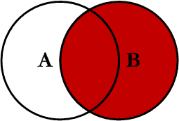

## Data Types

* `serial`
* `integer`
* `float`
* `text` vs `varchar`
* `bool`
* `date`
* `timestamp`

<https://www.postgresql.org/docs/current/static/datatype.html>

## Create Table

<https://www.postgresql.org/docs/current/static/sql-createtable.html>

### Show Databases, Tables, And Columns

```text
SHOW DATABASES
=> \l

SHOW TABLES
=> \d

SHOW COLUMNS
=> \d table

DESCRIBE TABLE
=> \d+ table
```

## Keywords

* `WHERE`
* `AND`
* `OR`
* `SELECT`
* `AS`
* `FROM`
* `INSERT INTO`
* `VALUES`
* `ORDER BY`
* `LIMIT`
* `IS NULL`
* `IS NOT NULL`
* `UPDATE`
* `DELETE`
* `HAVING`
* `LIKE`
* `DESC`
* `ASC`
* `COUNT()`
* `SUM()`
* `MIN()`
* `MAX()`
* `AVG()`

## (SELECT ... WHERE) vs (GROUP BY ... HAVING)

## JOINS

<table>
<tbody>
<tr>
<td>
Table: **t1**

```text
num | name
-----+------
   1 | a
   2 | b
   3 | c
```

</td>
<td>

Table: **t2**

```text
 num | value
-----+-------
   1 | xxx
   3 | yyy
   5 | zzz
```
</td>
</tr>
</tbody>
</table>

### INNER JOIN

* `JOIN` is the same as `INNER JOIN`
* `A (intersect) B`
* For each row R1 of T1, the joined table has a row for each row in T2
  that satisfies the join condition with R1. ([PostgreSQL
  Documentation])

```text
=> SELECT * FROM t1 INNER JOIN t2 ON t1.num = t2.num;
 num | name | num | value
-----+------+-----+-------
   1 | a    |   1 | xxx
   3 | c    |   3 | yyy
(2 rows)
```


## LEFT OUTER JOIN

  * `LEFT JOIN` is the same as `LEFT OUTER JOIN`
  * First, an `INNER JOIN` is performed (`A (intersect) B)`). Then,
    for each row in T1 that does not satisfy the join condition with
    any row in T2, a joined row is added with null values in columns
    of T2. Thus, the joined table always has at least one row for each
    row in T1. ([PostgreSQL Documentation])

```text
=> SELECT * FROM t1 LEFT JOIN t2 ON t1.num = t2.num;
 num | name | num | value
-----+------+-----+-------
   1 | a    |   1 | xxx
   2 | b    |     |
   3 | c    |   3 | yyy
(3 rows)
```


### RIGHT OUTER JOIN

  * `RIGHT JOIN` is the same as `RIGHT OUTER JOIN`
  * First, an `INNER JOIN` is performed (`A (intersect) B)`). Then,
    for each row in T2 that does not satisfy the join condition with
    any row in T1, a joined row is added with null values in columns
    of T1. This is the converse of a left join: the result table will
    always have a row for each row in T2.  ([PostgreSQL
    Documentation])

```text
=> SELECT * FROM t1 RIGHT JOIN t2 ON t1.num = t2.num;
 num | name | num | value
-----+------+-----+-------
   1 | a    |   1 | xxx
   3 | c    |   3 | yyy
     |      |   5 | zzz
(3 rows)
```




### FULL OUTER JOIN

  * `FULL JOIN` is the same as `FULL OUTER JOIN`
  * `A (union) B`
  * First, an `INNER JOIN` is performed (`A (intersect) B)`). Then,
    for each row in T1 that does not satisfy the join condition with
    any row in T2, a joined row is added with null values in columns
    of T2. Also, for each row of T2 that does not satisfy the join
    condition with any row in T1, a joined row with null values in the
    columns of T1 is added. ([PostgreSQL Documentation])

```text
=> SELECT * FROM t1 FULL JOIN t2 ON t1.num = t2.num;
 num | name | num | value
-----+------+-----+-------
   1 | a    |   1 | xxx
   2 | b    |     |
   3 | c    |   3 | yyy
     |      |   5 | zzz
(4 rows)
```


[PostgreSQL Documentation]: https://www.postgresql.org/docs/current/static/queries-table-expressions.html

## Example Queries

### On the command-line

1. `psql movielens`
2. Write questions (on paper) that you want to know.
3. Write SQL queries to answer those questions.

```text
When you are looking at results, it's in `vi-mode`:
  `j` is down, `k` is up, `q` is quit
  `SPACE` is page down, `/` is search

psql=> `CONTROL-D` to exit out of psql (same as `\q`)
```

### User 1 Rated Movies

```sql
SELECT m.id, m.title, l.tmdb_url
FROM movies m
JOIN (SELECT *
      FROM links
      WHERE movie_id IN (SELECT movie_id
                         FROM ratings
                         WHERE user_id = 1 AND rating >= 3)) l
ON m.id = l.movie_id;
```

### Movies with rating of 5

```sql
SELECT ml.title, ml.url
FROM (SELECT l.movie_id, m.title, l.tmdb_url as url
      FROM movies m
      JOIN links l
      ON m.id = l.movie_id) ml
JOIN (SELECT movie_id, avg(rating)
      FROM ratings
      GROUP BY movie_id
      HAVING avg(rating) = 5) r
ON ml.movie_id = r.movie_id;
```

### Movies with most ratings

```sql
SELECT movie_id, count(movie_id)
FROM ratings
GROUP BY movie_id
ORDER BY count(movie_id) DESC;
```

### Movies (including titles) with most ratings

```sql
SELECT m.title, r.rating_count
FROM movies m
JOIN (SELECT movie_id, count(movie_id) AS rating_count
      FROM ratings
      GROUP BY movie_id
      ORDER BY count(movie_id) DESC) r
ON m.id = r.movie_id;
```

### Movies with most ratings and best ratings

```sql
SELECT movie_id, count(movie_id), avg(rating)
FROM ratings
GROUP BY movie_id
HAVING avg(rating) >= 4 AND count(movie_id) > 20
ORDER BY count(movie_id) DESC;
```

### Links to movies with most ratings and best ratings

```sql
SELECT m.title, l.imdb_url
FROM links l
JOIN (SELECT m.id AS movie_id, m.title
      FROM movies m
      WHERE id IN (SELECT movie_id
                   FROM ratings
                   GROUP BY movie_id
                   HAVING avg(rating) >= 4 AND count(movie_id) > 20
                   ORDER BY count(movie_id) DESC)) m
ON m.movie_id = l.movie_id;
```
